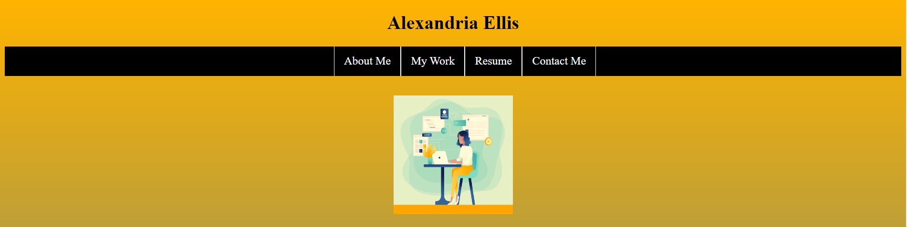

# <Module-2-Challenge>

## Description

For this challenge, our job as students was to start creating our personalized portfolio page using HTML and CSS. No pre-existing code was provided for this challenge.

My motivation to complete this project was to push myself to new limits and try new things. While completing this challenge, I learned how to link a URL to a photo. It was helpful to do further research when I got stuck on certain tasks.

## Usage

Click on the links in the navigation bar to be redirected to that section of the page.

## License

Please refer to the license in the repo.
